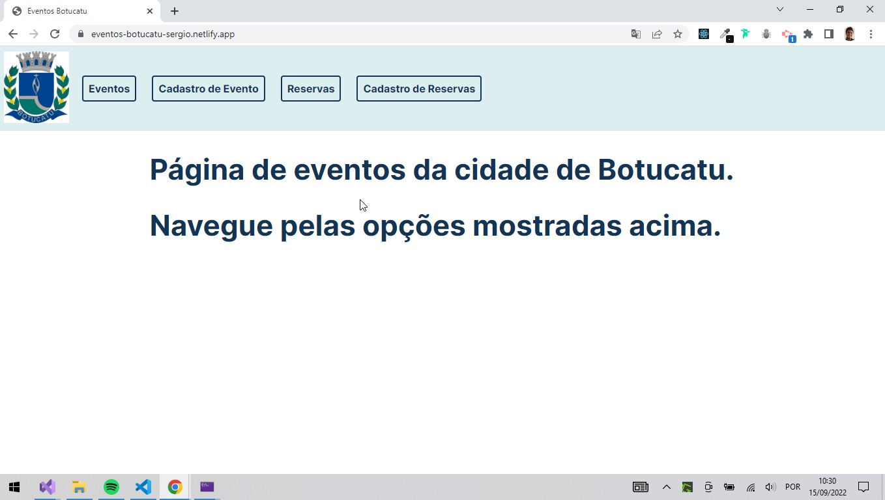
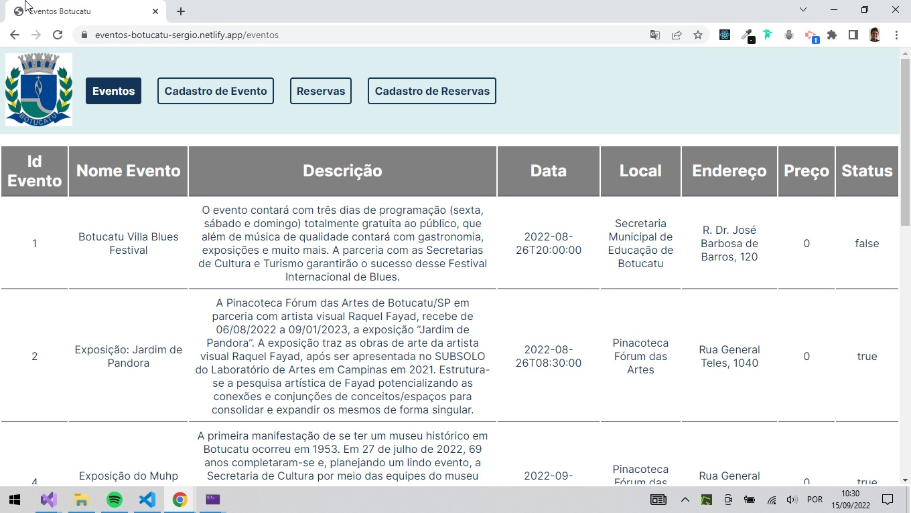
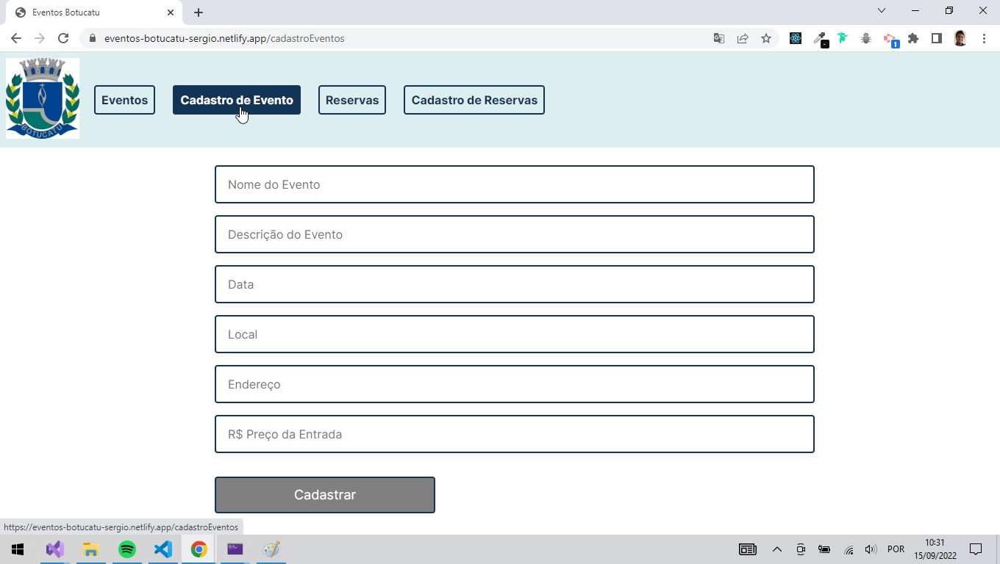
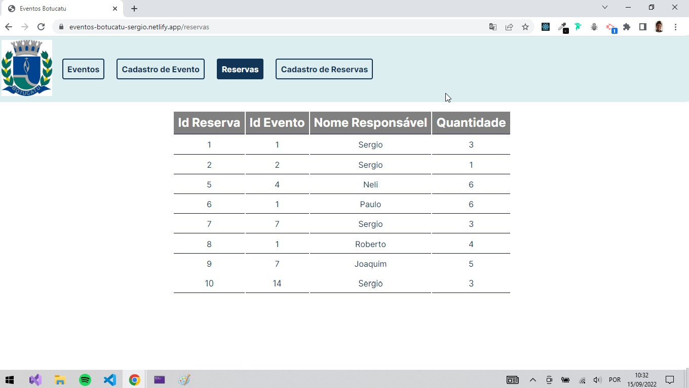
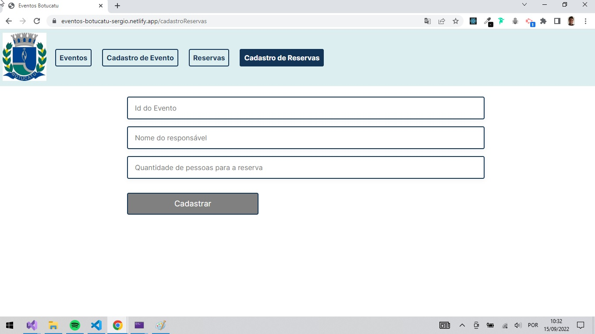

# Front End Para API Eventos Botucatu

## Parte Complementar ao Projeto Final do Módulo Programação Web III | Web API

O objetivo desse projeto era desenvolver um front end para consumir a API desenvolvida no curso da Top Coders, como uma parte complementar ao conteúdo do curso. 
Consiste em uma página que exibe os eventos de Botucatu cadastrados no banco de dados, permite cadastrar novos eventos, e também consultar/cadastrar reservas para os eventos.

OBS: As ferramentas utilizadas para este desenvolvimento não foram abordadas no curso.

> Professora Amanda Mantovani  
> https://github.com/AmandaMantovani

 

--- 
 

📋 Conceitos abordados e ferramentas utilizadas: 
- Front end com React Js;
- Desenvolvimento com componentes;
- Styled components;
- Consumo de API;
- Vite;

 

--- 
 

## 🚀 Como executar o programa
- Para executar esse programa, precisamos de duas APIs que serão consumidas:
  - API para geração de token de acesso para cadastro de eventos e reservas:
  > https://github.com/sergiofdf/LetsCode_WebIII

  - API para comunicação com os eventos e reservas
  > https://github.com/sergiofdf/APIEventosBotucatu

- Após ter as duas APIs em execução, você pode executar esse projeto:
  - Clone o repositório: `git clone https://github.com/sergiofdf/botucatuEvents.git`

  - Execute o projeto abrindo sua pasta em um terminal, e executando o comando `npm run dev`.

- Também foi feito deploy do projeto no Netlify:
  >https://eventos-botucatu-sergio.netlify.app/eventos

  OBS: Note que mesmo para execução no site, as APIs devem estar em execução local.

  ---
## 📲 Apresentação do Projeto

Página Inicial

 

Lista de eventos cadastrados

 

Formulário para cadastro de um novo evento

 

Lista de reservas cadastradas

 

Formulário para cadastro de uma nova reserva

